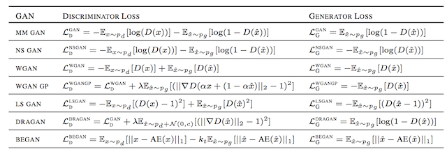

# Generative Models Collection
Generative Model related code and info

| ML Models  | Reference |
| ------------- | ------------- |
| [Self-Attention Generative Adversarial Networks](SAGAN.py) | [Arxiv](https://arxiv.org/abs/1805.08318) |
| [Multi-Scale Gradients Generative Adversarial Networks](MSGGAN.py) | [Arxiv](https://arxiv.org/abs/1903.06048) |
| [Cycle-Consistent Generative Adversarial Networks](CycleGAN.py) | [Machine Learning Mastery](https://machinelearningmastery.com/cyclegan-tutorial-with-keras/); [Arxiv](https://arxiv.org/abs/1703.10593) |
| [Progressive Growing Generative Adversarial Networks](PGGAN.py) | [Machine Learning Mastery](https://machinelearningmastery.com/how-to-train-a-progressive-growing-gan-in-keras-for-synthesizing-faces/); [Arxiv](https://arxiv.org/abs/1710.10196) |
| [Neural style transfer](NST.py) | [Tensorflow](https://www.tensorflow.org/tutorials/generative/style_transfer); [Arxiv](https://arxiv.org/abs/1508.06576) |

<br>

## Training & Stabilizing
* Using small dataset like [CIFAR](https://www.cs.toronto.edu/~kriz/cifar.html), [CelebA](https://www.kaggle.com/jessicali9530/celeba-dataset), [Horses2Zebra](https://people.eecs.berkeley.edu/~taesung_park/CycleGAN/datasets/horse2zebra.zip) to test algorithm before scale whole thing up: save time, whatever you can!

* Normalize the inputs between -1 and 1 for both generator and discriminator

* Sample from gaussian distribution rather than uniform distribution

* All normalizations methods are potentially helpful, **SpectralNorm**, **BatchNorm**(when have label using **ConditionalBatchNorm** or don't have label using **SelfModulationBatchNorm**), consider other methods like **InstanceNorm** or **PixelNorm** when BatchNorm is not an option

* Avoid Sparse Gradients(e.g **ReLU**, **MaxPool**), using **LeakyReLU** in both generator(could also use **ReLU**) and discriminator, For Downsampling, use **Average Pooling**, **Conv2d + stride**, For Upsampling, use **NearestUpsampling**, **PixelShuffle**, **ConvTranspose2d + stride**

* Model architecture with usual form of **ResnetBlock** is usually better than without

* Overfitting of generator usually happen after long epochs of training, generator starting generate good samples make discriminator hard to discriminate, so discriminator starting produce misleading gradients to generator, to avoid it use data augmentation technique call the [**Adaptative Discriminator Augmentation(ADA)**](https://github.com/NVlabs/stylegan2-ada)

* Use stability tricks from RL e.g **Experience Replay**

* Try different loss function

    ```
    # usually hinge loss works well
    L_D = −E[min(0,−1 +D(x))] − E[min(0,−1−D(G(z)))]
    L_G = −E[G(z)]
    ```
    

* Optimizer **ADAM** and **RMSprop** usually work well

* Track failures early using plot(e.g tensorboard), some common failure mode are:   
    * discriminator loss goes to 0
    * gradients of generator or discriminator extremely large or extremely small
    * If loss of the generator steadily decreases, it is likely fooling the discriminator with garbage images
    * when outputs of generator have large percentage of repetitions then it's mode collapse

* Other methods for improve convergence of GAN: 
    * Feature matching: Develop a GAN using semi-supervised learning
    * Minibatch discrimination: Develop features across multiple samples in a minibatch
    * Virtual batch normalization: Calculation of batch norm statistics using a reference batch of real images
    * One side soft label for some loss function(e.g sigmoid cross entropy loss): real=0.9, fake=0
    * Two-timescale update rule(TTUR): using separate learning rates for the generator and the discriminator(usually lr_d > lr_g), making it possibleto use fewer discriminator steps per generator step
    * All regularization and constraint methods are potentially helpful, e.g use dropout of 50 percent during train and generation
